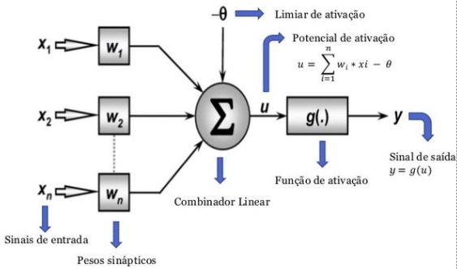
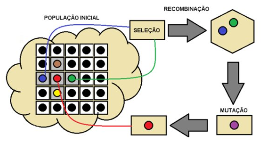
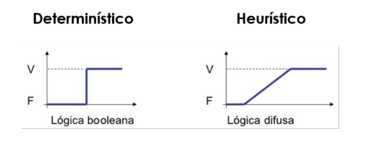

# Introdução ao machine learning

O objetivo do Machine Learning é criar máquinas que pensam como humanos.

É usado como treinamento de sistemas de inteligência artificial, feito com tomada de decisão com suporte de base de regras bem definidas.

Hoje em dia existem basicamente três tipos de inteligências artificiais: IA Geral (capaz de fazer tudo) e IA Restrita que é treinada para fazer apenas uma coisa e o aprendizado de máquina.

### Teste de Turing

Feito com que um humano converse com uma IA sem saber disso, a fim de testar se a IA consegue se passar por um humano.

---

### Qual relação entre Machine Learning (ML) e Inteligência Artificial (IA) ?

Por meio do ML obtemos ou não uma IA restrita. O ML é a etapa de aprendizado de máquina, através de uma base de dados ( treinamento ) que pode resultar em uma IA

---

### Métodos de Machine Learning Bioinspirados

São algoritmos inspirados no comportamento de seres vivos em convivência social, são métodos heurísticos (não determinísticos) e que buscam a melhor solução global (melhor solução em um contexto onde múltiplas soluções são possíveis)

Qual a diferença entre valores determinísticos e heurísticos

---

### Redes Neurais Artificiais

É um algoritmo bioinspirado que tenta imitar o comportamento dos neurônios do nosso cérebro, na computação é um tipo de inteligência artificial que toma decisoes com base no resultado da passagem de dados entre vários “neurônios”

 

O treinamento gera um arquivo com os pesos de cada neurônio

---

### Algoritmos Genéticos

É uma técnica de busca utilizada na ciência da computação para achar soluções paroximadas em problemas de otimização e busca.

O fundamento dos algoritmos genéticos é dado pela evolução das amostras.

Normalmente um algoritmo genético tem algumas etapas em comum:

1. Formação da população base
2. A população é ordenada com base nas suas características através de uma função **FITNESS** 
3. Os melhores indivíduos são recombinados através do cruzamento de seus genes (**CROSSOVER**)
4. A mutação ocorre alterando um ou mais fator dos indivíduos gerados.

Esse processo pode ocorrer mais vezes para satisfazer a solução do problema

Os algoritmos genéticos são heurísticos, e buscam a melhor solução global

São usados pois podem ensinar um agente o funcionamento de algo desde o ponto “0”

---

### Máquina de Vetores de Suporte (SVM)

Atuam parecidamente com o RNA porém a diferença é que a SVM cria um hiperplano para separar as classes.

Tem o tipo de aprendizado supervisionado ou não supervisionado e age otimizando as margens